# 逆向工程核心原理


## 第二章 逆向分析 Hello World! 程序
#### 设置“大本营”的四种方法
1. Goto命令
  - 执行 `Go to（Ctrl+G）`命令，打开一个 `Enter experssion to follow（输入跟踪表达式）` 对话框，输入地址，执行 `Execute till cursor（F4）` 命令，让调试流运行到该处。
2. 设置断点
  - 可以设置 `BP（Break Point 断点）（快捷键F2）` 让调试流转到“大本营”，在 OllyDbg 菜单栏依次选择 `View-Breakpoints` 选项（快捷键 ALT+B），可以打开 Breakpoints 对话框。
3. 注释
  - 按键盘上的 `';'` 键可以在指定地址处添加注释，在鼠标右键菜单中依次选择 `Search for-User defined comment`，可以显示用户输入的所有注释。
4. 标签
  - 按 `':'` 键可以输入标签，鼠标右键依次选择 `Search for\User defined labels` 可以打开用户标签窗口。

#### 快速查找指定代码的四种方法
1. 代码执行法
  - 逐条执行指定指令来查找需要查找的位置。
2. 字符串检索法
  - 鼠标右键菜单依次选择 `Search for-All referenced text strings`。
3. API检索法1：在调用代码中设置断点
  - 鼠标右键菜单依次选择 `Search for-All intermodular calls`，查看程序中调用的所有 API。
4. API检索法2：在API代码中设置断点
  - 在使用了压缩器/保护器工具对可执行文件进行压缩或保护之后，文件结构会改变，就无法列出 API 调用列表了。这种情况下，DLL 代码库被加载到进程内存后，我们可以直接向 DLL 代码库添加断点。
  - 在菜单栏依次选择 `View-Memory`菜单（快捷键ALT+Ｍ），显示进程内存。
  - 鼠标右键菜单依次选择 `Search for-Name in all calls`。找到需要的函数后双击即可。

#### 修改字符串的两种方法
1. 直接修改字符串缓冲区
  - 在 `Dump` 窗口按 `Ctrl+G` 执行 `Go to` 命令，输入地址进入字符串缓冲区，使用鼠标选择字符串，按 `Ctrl+E` 打开编辑窗口，就可以用新字符串覆盖该区域。注意 `Unicode` 字符串必须以 `NULL` 结束，它占据2个字节。
  - 这是我们的修改是暂时的，需要把更改后的程序另存为一个可执行文件。选择更改的内容，鼠标右键选择 `Copy to executable`，在弹出的 `Hex` 窗口中单击鼠标右键，选择 `Save file`。
2. 在其他内存区域新建字符串并传递给消息函数
  - 在内存的某个区域新建一个字符串，并把新字符串的首地址传递过去。

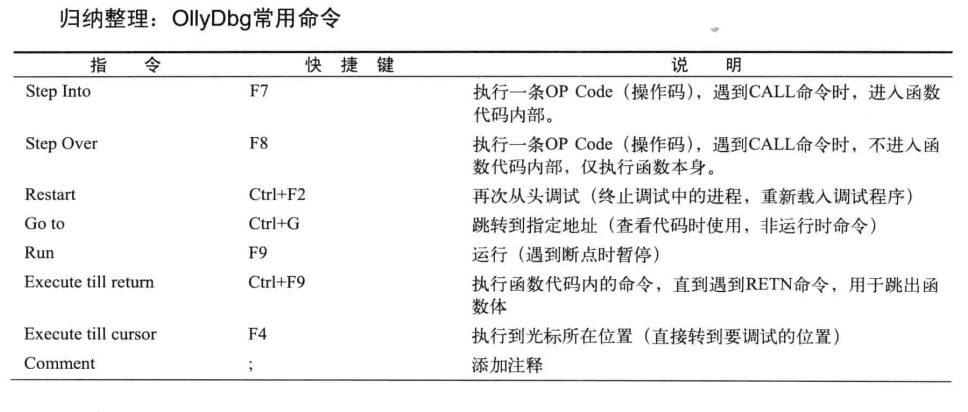

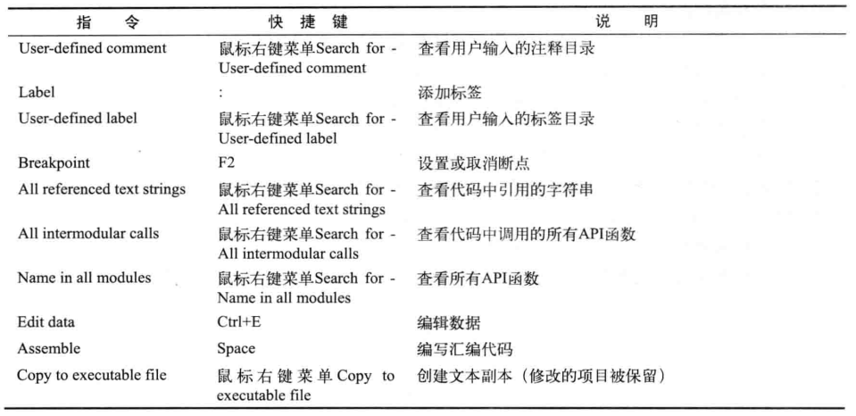


## 第三章 小端标记法

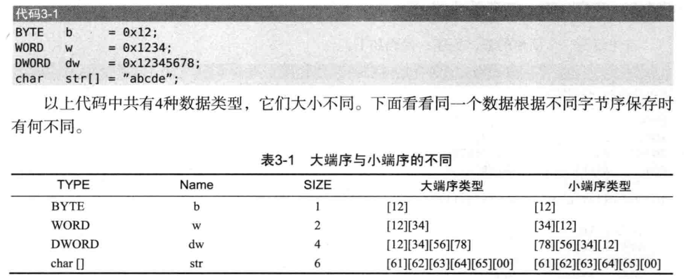


## 第四章 IA-32寄存器基本讲解

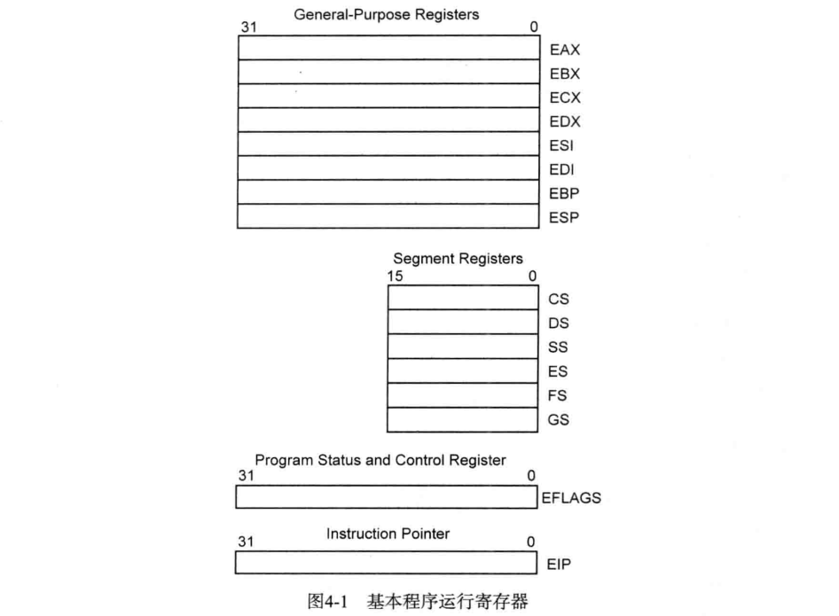


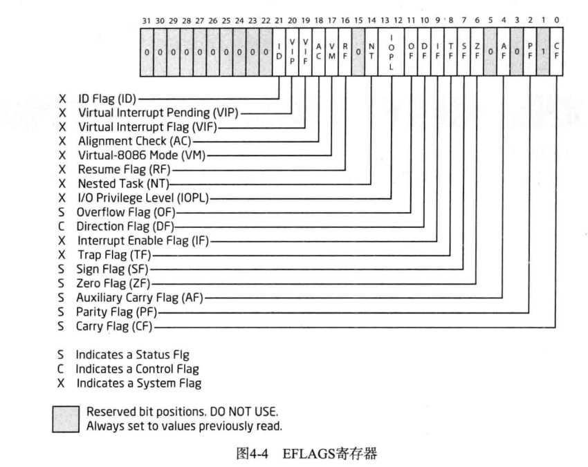


## 第十章 函数调用约定
1. cdecl
  - C语言中使用的方式，调用者负责处理栈。
2. stdcall
  - 常用于 Win32 API，由被调用者清理栈。
3. fastcall
  - 与 stdcall 方法基本类似，但通常使用寄存器去传递参数。


## 第十三章 PE文件格式
#### 基本结构

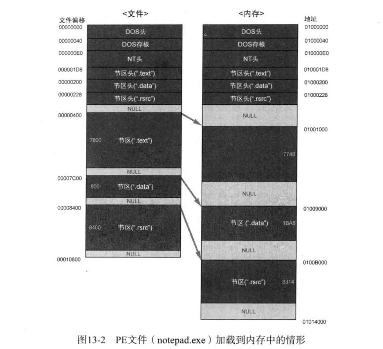

`VA` 指的是进程虚拟内存的绝对地址，`RVA（Relative Virtual Address，相对虚拟地址）指从某个基准位置（ImageBase）开始的相对位置。换算关系：`RVA+ImageBase=VA`。

#### PE头
1. DOS头
  - 在PE头的最前面是一个 `IMAGE_DOS_HEADER` 结构体。


#### DOS存根
DOS存根（stub）在DOS头下方，是个可选项，大小不固定，由代码和数据混合而成。


#### NT头
由签名、文件头和可选头三个结构体组成。


#### NT头：文件头
1. Machine
  - 每个CPU都有唯一的 Machine 码。
2. NumberOfSections
  - 用来指出文件中存在的节区数量。
3. SizeOfOptionalHeader
  - 用来指出 `IMAGE_OPTIONAL_HEADER32` 结构体的长度。
4. Characteristics
  - 标识文件属性。

#### NT头：可选头


1. Magic
2. AddressOfEntryPoint
  - 持有 EP 的 RVA 值，指出程序最先执行的代码起始地址。
3. ImageBase
  - 指出文件的优先装入地址。
4. SectionAlignment，FileAlignment
  - `SectionAlignment` 指定了节区在内存中的最小单位，`FileAlignment` 指定了节区在磁盘文件中的最小单位。
5. SizeOfImage
  - 指定了 `PE Image` 在虚拟内存中所占空间的大小。
6. SizeOfHeader
  - 指出整个 PE 头的大小。
7. Subsystem
  - 用来区分系统驱动文件（*.sys）与普通的可执行文件 （*.exe, *.dll）。
8. NumberOfRvaAndSizes
  - 用来指定 `DataDirectory` 数组的个数。
9. DataDirectory
  - 由 `IMAGE_DATA_DIRECTORY` 结构体组成的数组。


#### 节区头


#### RVA to RAW
从内存地址到文件偏移的映射：
1. 查找 RVA 所在节区
2. 使用简单的公式计算文件偏移
```
RAW - PointerToRawData = RVA - VirtualAddress
                   RAW = RVA - VirtualAddress + PointerToRawData
```

#### IAT
IAT（Import Address Table，导入地址表）是一种表格，用来记录程序正在使用哪些库中的哪些函数。
1. DLL
  - DLL（Dynamic Linked Library，动态链接库）的加载方式有两种：显示链接--即程序使用使用 DLL 时加载，使用完毕后释放内存；隐式链接--程序开始时即一同加载 DLL，程序终止时再释放内存。其中 IAT 提供的机制与隐式链接有关。
2. IMAGE_IMPORT_DESCRIPTOR
  - 记录了 PE 文件要导入哪些库文件。


#### EAT
EAT 是一种核心机制，使不同的应用程序可以调用库文件中提供的函数。只有通过 `EAT` 才能从相应库中导出函数的起始地址，`IMAGE_EXPORT_DIRECTORY` 结构体保存着导出信息。


`kernel32.dll` 文件的 `IMAGE_EXPORT_DIRECTORY` 结构体与整个 `EAT` 结构：


从库中获得函数地址的 API 为 `GetProcAddress()` 函数，操作原理如下：


## 第十六章 基址重定位表
#### PE重定位
向进程的虚拟地址加载 PE 文件时，文件会被加载到 PE 头的 `ImageBase` 所指的地址处。若加载的是 `DLL（SYS）` 文件，且在 `ImageBase` 位置处已经加载了其他 `DLL（SYS）` 文件，那么PE装载器就会将其加载到其他空间，这就是PE重定位。


#### 基址重定位表
位于 PE 头的 `DataDirectory` 数组的第六个元素：`IMAGE_BASE_RELOCATION` 结构体。


## 第二十章 内嵌补丁练习


## 第二十一章 Windows消息钩取


使用 `SetWindowsHookEx()` API 来实现消息钩子：


钩子过程（hook procedure）是由操作系统调用的回调函数。安装消息钩子时，钩子过程需要存在于某个DLL内部，且该DLL的示例句柄（instance handle）即是 hMod。设置好钩子后，在某个进程中生成指定消息时，操作系统会将相关的DLL文件强制注入相应进程，然后调用注册的钩子过程。


## 第二十三章 DLL注入
DLL注入指的是向运行中的其他进程强制插入特定的DLL文件。使用 `LoadLibrary()` API 加载某个 DLL 时，该 DLL 中的 `DllMain()` 函数会被调用执行。


DLL注入的三种方法：
1. 创建远程线程（CreateRemoteThread() API）
2. 使用注册表（AppInit_DLLs值）
3. 消息勾取（SetWindowsHookEx() API）


## 第二十四章 DLL卸载
DLL卸载是将强制插入进程的DLL弹出的技术，原理是驱使目标进程调用 `FreeLibrary()` API。


## 第二十五章 通过修改PE加载DLL
通过直接修改目标程序的可执行文件，使其运行时强制加载指定的DLL文件，这种方法只要应用过一次后，每当进程开始运行时就会自动加载指定的DLL文件。


## 第二十七章 代码注入
代码注入是一种向目标进程插入独立运行代码并使之运行的技术，它一般调用 `CreateRemoteThread()` API 以远程线程形式运行插入的代码，所以也被称为线程注入。

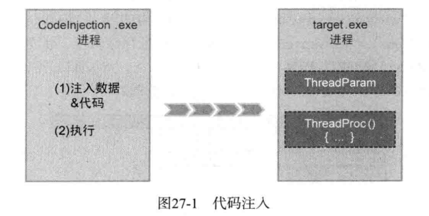

在此过程中，代码以线程过程（Thread Procedure）形式插入，数据以线程参数的形式传入。代码注入技术的核心内容是注入可独立运行的代码。

## 第二十九章 API钩取
正常调用API：


钩取API调用：


技术图表：

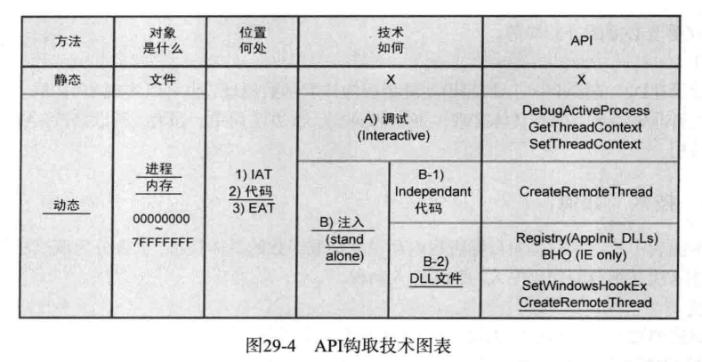

调试技术：


## 第三十八章 PE32+
- IMAGE_NT_HEADERS：


- IMAGE_FILE_HEADERS：

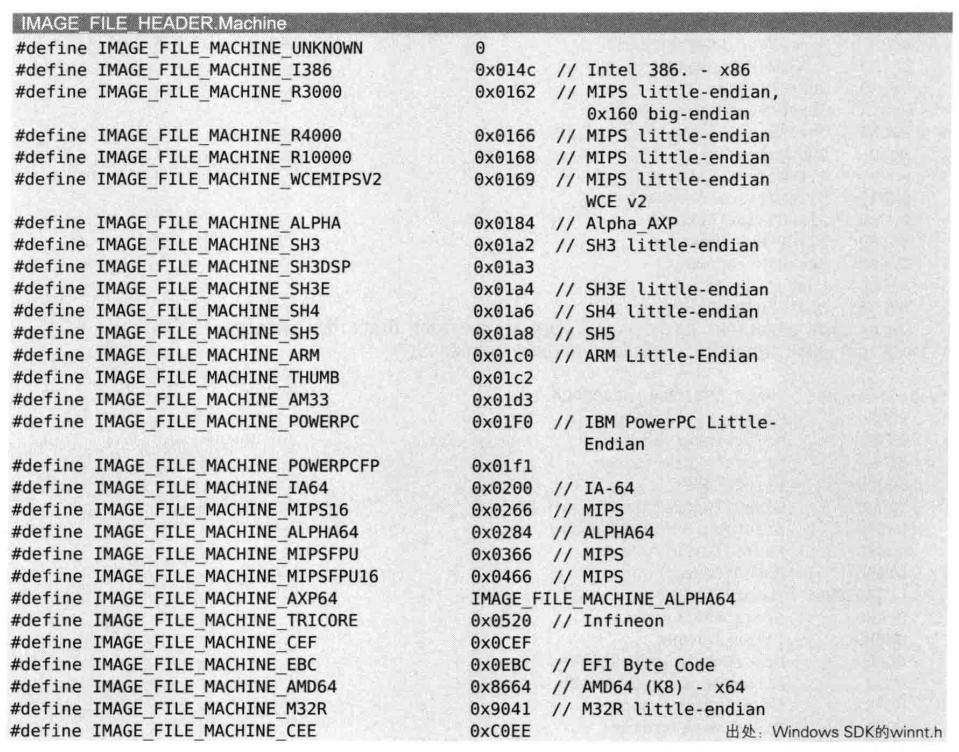

- IMAGE_OPTIONAL_HEADERS：

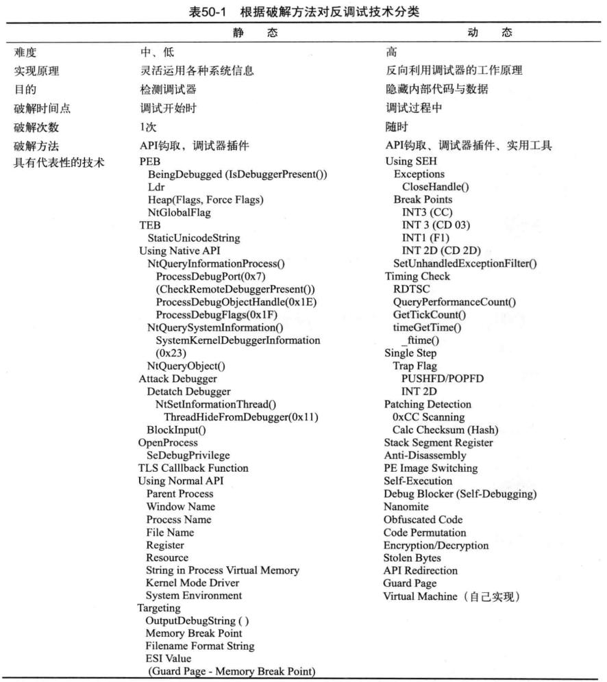

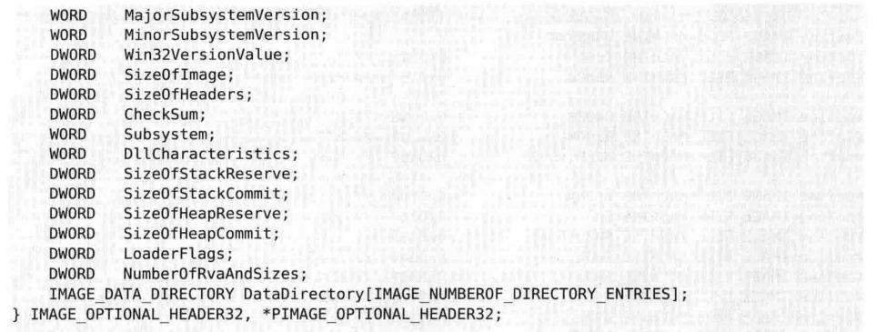

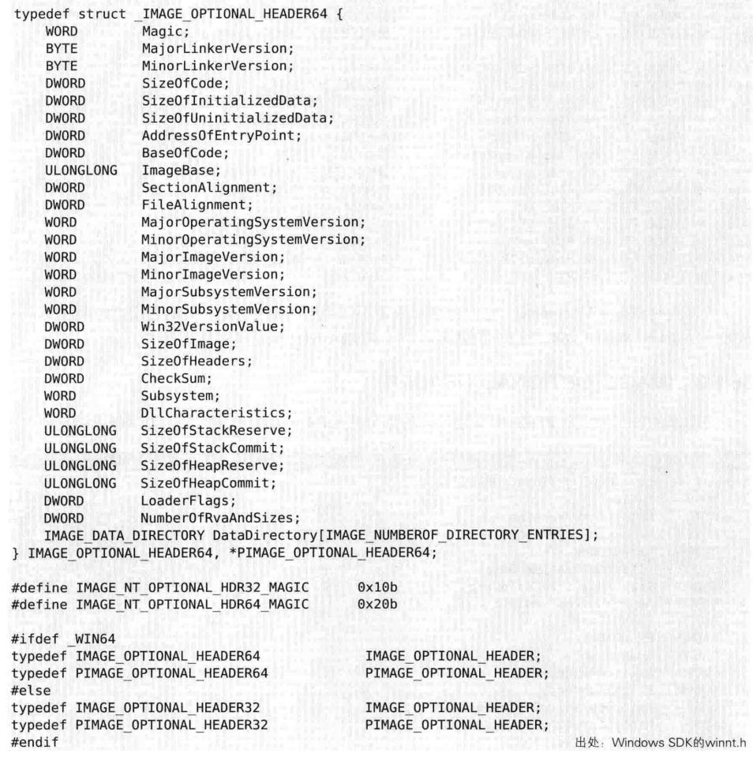

- IMAGE_THUNK_DATA：

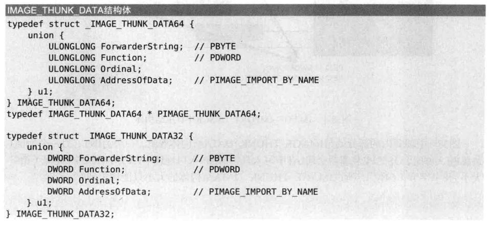


- IMAGE_TLS_DIRECTORY：

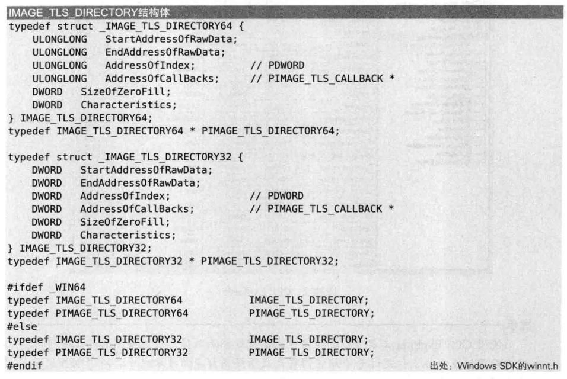


## 第五十章 反调试技术

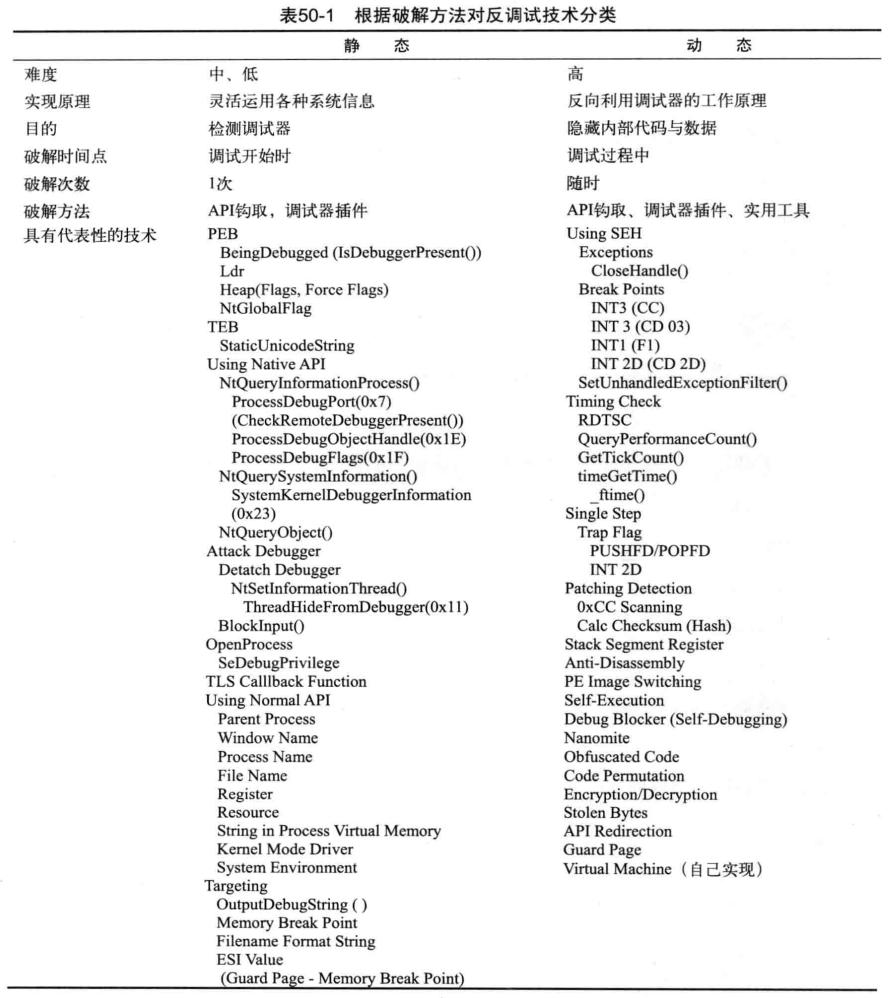

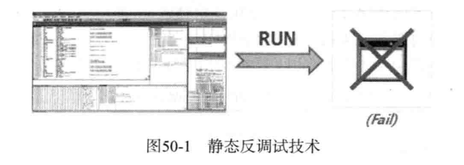

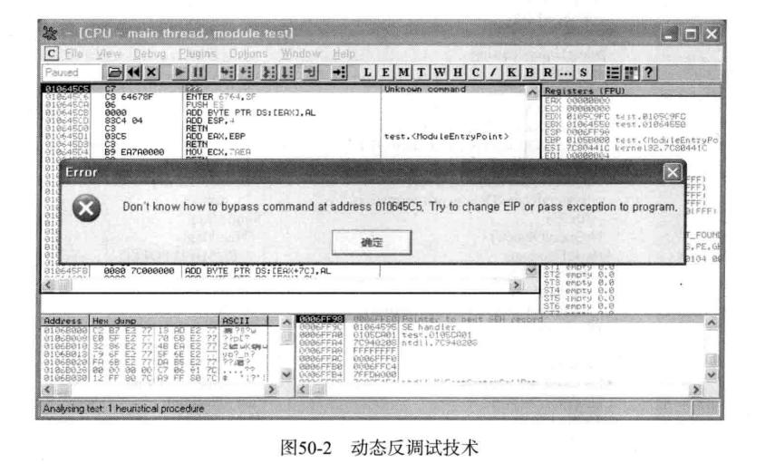
