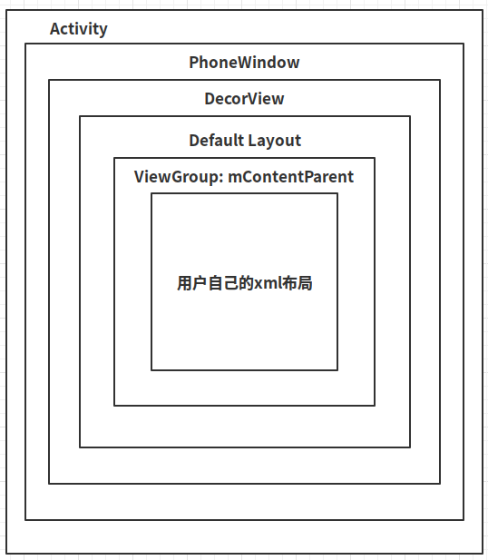
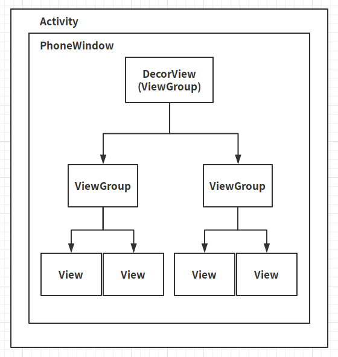
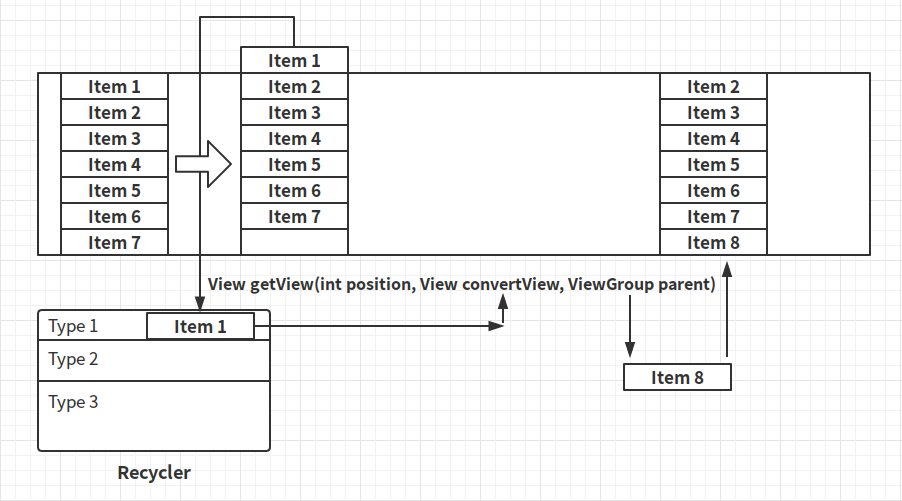

# Android 开发进阶——从小工到专家

## 第一章 四大组件
#### Activity的构成

实际上视图会被设置给一个 `Window` 类，这个 `Window` 中含有一个 `DecorView`，这个 `DecorView` 才是整个窗口的顶级视图。开发人员设置的布局会被设置到这个 `DecorView` 的 `mContentParent` 布局中。也就是说 Android 实际上内置了一些系统布局文件 xml， 我们在 xml 中定义的视图最终会被设置到这些系统布局的特定节点之下，形成了整个 `DecorView`。



#### Service与AIDL

`Service` 默认执行在 UI 线程中，因此不要在 `Service` 中执行耗时的操作，除非在 `Service` 中创建了子线程来完成耗时操作。

1. 普通Service

服务只有 `onCreate`，`onStartCommand`和`onDestory` 三个生命周期。一旦在任何位置调用了 `Context` 的 `startService()` 函数，相应的服务就会启动，首次创建时会调用 `onCreate` 函数，然后回调 `onStartCommand()` 函数。服务启动之后会一直保持运行状态，直到 `stopService()` 或 `stopSelf()` 函数被调用。虽然每调用一次 `startService()` 函数， `onStartCommand()` 就会执行一次，但实际上每个服务只会存在一个实例。
```java
public class MyService extends Service {
    @Override
    public int onStartCommand(Intent intent, int flags, int startId) {
        doMyJob(intent);
        return super.onStartCommand(intent, flags, startId);
    }
    private void doMyJob(Intent intent) {
        // 从Intent中获取数据
        // 执行相关操作
        new Thread() {
            @Override
            public void run() {
                // 耗时操作
            }
        }.start();
    }
    @Nullable
    @Override
    public IBinder onBind(Intent intent) {
        return null;
    }
}
```

2. IntentService

`IntentService` 将用户的请求执行在一个子进程中，用户只需要覆写 `onHandleIntent` 函数即可。在执行完毕之后 `IntentService` 会调用 `stopSelf` 自我销毁。
```java
public class myIntentService extends Service {
    myIntentService() {
        super(myIntentService.class.getName());
    }
    @Override
    protected void onHandleIntent(Intent intent) {
        // 这里执行耗时操作
    }
}
```

3. 运行在前台的Service

`Service` 默认运行在后台，优先级相对较低，在系统内存不足时，可能会被回收掉。而运行在前台的 `Service` 不仅不会被回收，还会在通知栏显示一条消息。我们可以在 `onCreate` 函数中调用 `showNotification` 函数显示通知，调用 `startForeground` 将服务设置为前台服务。

4. AIDL（Android接口描述语言）

通常用于进程间通信。编译器根据 `AIDL` 文件生成一个系列对应的 Java 类，通过预先定义的接口以及 `Binder` 机制达到进程间通信的目的。通俗说，AIDL就是一个接口，客户端通过 `bindService` 来与远程服务建立一个连接，在该连接建立时会返回一个 `IBinder` 对象，该对象是服务端 `Binder` 的 `BinderProxy`，在建立连接时，客户端通过 `asInterface` 函数将该 `BinderProxy` 对象包装成本地的 `Proxy`，并将远程服务端的 `BinderProxy` 对象赋值给 `Proxy` 类的 `mRemote` 字段，就是通过 `mRemote` 执行远程函数调用。

#### Broadcast（广播）

1. 普通广播

完全异步，通过 `Context` 的 `sendBroadcast()` 函数来发送，缺点是不能将处理结果传递给下一个接受者，并且无法终止广播 `Intent` 的传播。

2. 有序广播

通过 `Context.sendOrderedBroadcast()` 来发送，所有的广播接收器按照优先级依次执行，优先级通过 `receiver` 的 `intent-filter` 中的 `android:priority` 属性来设置，数值越大优先级越高。当广播接收器接收到广播后，可以使用 `setResult()` 函数把结果传递给下一个广播接收器，然后通过 `getResult()` 函数来取得上一个接收器返回的结果，并可以用 `abortBroadcast()` 函数来让系统丢弃该广播。

3. 本地广播

使用 `Support v4` 包中的 `LocatBroadcastManager` 实现本地广播，只需要把调用 `context` 的 `sendBroadcast`、`registerReceiver`、`unregisterReceiver`的地方替换成 `LocalBroadcastManager getInstance (Context context)` 中对应的函数即可。

4. sticky广播

通过 `Context.sendStickyBroadcast()` 函数来发送，用此函数发送的广播会一直滞留，当有匹配此广播的接收器被注册后，该接收器就会收到此条广播。`sendStickyBroadcast` 值保留最后一条广播，并且一直保留下去，这样即使已经有广播接收器处理了该广播，当再有匹配的广播接收器被注册，此广播仍会被接收。如果只想处理一遍广播，可以通过 `removeStickyBroadcast()` 函数实现。

需要权限：
```java
<uses-permission android:name="android.permission.BROADCAST_STICKY" />
```

##### ContentProvider（外共享数据）

`ContentProvider` 实际上是对 `SQLiteOpenHelper` 的封装，通过 `Uri` 映射来进行操作。

## 第二章 View与动画
#### 重要的View控件



1. ListView和GridView

列表数据显示的4个元素：
- 用来展示列表的 ListView；
- 用来把数据映射到 ListView 上的 Adapter；
- 需要展示的数据集；
- 数据展示的 View 模板；

需要实现的 `Adapter` 函数有：
- `getCount()` 函数——获取数据的个数；
- `getItem(int)` 函数——获取 position 位置的数据；
- `getItem(int)` 函数——获取 position 位置的数据 id，一般直接返回 position 即可；
- `getView(int, View, ViewGroup)` 函数——获取 position 位置上的 Item View 视图。

Android 采用视图复用的形式避免创建过多的 `Item View`：



```java
public View getView(int position, View convertView, ViewGroup parent) {
    View view = null;
    // 有视图缓存，复用视图
    if (convertView != null) {
        view = convertView;
    } else {
        // 重新加载视图
    }
    // 进行数据绑定
    // 返回Item View
    return view;
}
```
我们知道 `ListView` 运用了 `Adapter` 模式，但是，在 `Adapter` 类中还运用了观察者模式， `Adapter` 内部有一个可观察者类，`ListView` 则作为它的其中一个观察者。在将 `Adapter` 设置给 `ListView` 时，`ListView` 会被注册到这个观察者对象中：
```java
@Override
public void setAdapter(ListAdapter adapter) {
    resetList();
    // 清空视图缓存mRecycler
    mRecycler.clear();
    if (mAdapter != null) {
        mDataSetObserver = new AdapterDataSetObserver();
        // 将mDataSetObserver注册到adapter中
        mAdapter.registerDataSetObserver(mDataSetObserver);
    } else {
        // 代码省略
    }
    requestLayout();
}
```
我们看到，设置 `Adapter` 时创建了一个 `AdapterDataSetObserver` 对象，然后注册到 `mAdapter` 中。

我们看一下 `Adapter` 基类—— `BaseAdapter`：
```java
public abstract class BaseAdapter implements ListAdapter, SpinnerAdapter {
    private final DataSetObservable mDataSetObservable = new DataSetObservable();
    public void registerDataSetObserver(DataSetObserver observer) {
        mDataSetObservable.registerObserver(observer);
    }
    public void notifyDataSetChanged() {
        mDataSetObservable.notifyChanged();
    }
    // 代码省略
}
```
我们看到，注册观察者实际上调用了 `DataSetObservable1` 对应的函数。`DataSetObservable` 拥有一个观察者集合，当可观察者发生变更时，就会通知观察者做出相应的处理：

```java
public abstract class Observable<T> {
    // 观察者列表
    protected final ArrayList<T> mObservers = new ArrayList<T>();
    public void registerObserver(T observer) {
        if (observer == null) {
            throw new IllegalArgumentException("The observer is null.");
        }
        synchronized(mObservers) {
            // 代码省略
            // 注册观察者
            mObservers.add(observer);
        }
    }
}
```

当 `Adapter` 的数据源发生变化时，会调用 `Adapter` 的 `notifyDataSetChanged` 函数，在该函数中又会调用 `DataSetObservable` 对象的 `notifyChanged` 函数通知所有观察者数据发生了变化，是观察者进行相应的操作：
```java
public class DataSetObservable extends Observable<DataSetObserver> {
    public void notifyChanged() {
        synchronized(mObservers) {
            for (int i = nObservers.size() - 1; i >= 0; i--) {
                // 调用观察者的onChanged函数
                mObservers.get(i).onChanged();
            }
        }
    }
}
```

对于 `ListView` 来说，这个观察者就是 `AdapterDataSetObservable` 对象，该类声明在 `AdapterView` 类中，也是 `ListView` 中的一个父类：
```java
// AdapterView的内部类AdapterDataSetObserver对象中
class AdapterDataSetObserver extends DataSetObserver {
    private Parcelable mInstanceState = null;
    @Override
    public void onChanged() {
        mDataChanged = true;
        mOldItemCount = mItemCount;
        // 获取元素个数
        mItemCount = getAdapter().getCount();
        // 代码省略
        checkFocus();
        // 重新布局
        requestLayout();
    }
    // 代码省略
}
```

我们看到，在 `AdapterDataSetObserver` 的 `onChanged` 函数中会调用 `ViewGroup` 的 `requestLayout()` 函数更新整个 `ListView` 的 `ItemView`。

在 `AdapterDataSetObserver` 的 `onChanged` 函数中，实际调用的是 `AdapterView` 或 `ViewGroup` 类中的属性或者函数完成功能，因此，`AdapterDataSetObserver` 只是在外层做了一下包装，真正核心的功能应该是｀ListView`，确切 地说是 `AdapterView`。`ListView` 就是通过 `Adapter` 模式、观察者模式、`ItemView`复用机制实现高效的列表显示。

同样，`GridView` 与 `ListView` 雷士，只是布局方式为网格式布局。

2. RecyclerView

`RecyclerView` 也使用了 `Adapter`，但这个 `Adapter` 是一个静态内部类，含有一个泛型参数 `VH`，代表 `ViewHolder`。`RecyclerView` 还封装了一个 `ViewHolder` 类型，含有一个 `itemView` 字段，代表每一项数据的根视图，需要在构造函数中传递给 `ViewHolder` 对象。

```java
public class RecyclerAdapter extends Adapter<RecyclerViewHolder> {
    List<String> mDataSet = new ArrayList<String>();
    @Override
    public int getItemCount() {
        return mDataSet.size();
    }
    @Override
    public void onBindViewHolder(RecyclerViewHolder viewHolder, int position) {
        // 绑定数据
        viewHolder.nameTv.setText(mDataSet.get(position));
    }
    @Override
    public RecyclerViewHolder onCreateViewHolder(ViewGroup parent, int viewType) {
        // 创建ViewHolder
        return new RecyclerViewHolder(new TextView(parent.getContext()));
    }
    // 自定义ViewHolder
    static class RecyclerViewHolder extends ViewHolder {
        TextView nameTv;
        public RecyclerViewHolder(View itemView) {
            super(itemView);
            nameTv = (TextView)itemView.findViewById(R.id.username_tv);
        }
    }
}
```

`RecyclerView` 的另一大特点是将布局方式抽象为 `LayoutManager`，提供了 `LinearLayoutManager`、`GridLayoutManager`、`StaggeredGridLayoutManager` 三种布局。

3. ViewPager

通常用于显示 Fragment，而 ViewPager 与 Fragment 组合时通常会有一个指示器（ViewPagerIndicator）表明当前显示的是哪个页面。

## 第三章 多线程
#### Android中的消息机制

1. 处理消息的手段——Handle、Looper和MessageQueue

应用启动时，后默认有一个主线程（UI线程），在这个线程中会关联一个消息队列，所有的操作都会被封装成消息然后交给主线程处理。为了保证主线程不会主动退出，会将获取消息的操作放在一个死循环中。


UI线程的消息循环是在 `ActivityThread.main` 方法中创建的，该函数为 Android 应用程序的入口：
```java
public static void main(String[] args) {
    // 代码省略
    Process.setArgV0("<pre-initialized>");
    Looper.prepareMainLooper(); // 1.创建消息循环Looper
    ActivityThread thread = new activityThread();
    thread.attach(false);
    if (sMainThreadHandler == null) {
        sMainThreadHandler = thread.getHandler(); // UI线程的Handler
    }
    AsyncTask.init();
    // 代码省略
    Looper.loop(); // 2.执行消息循环
    throw new RuntimeException("Main thread loop uexpectedly exited");
}
```

在子线程执行完操作后，可能需要更新 UI，可是在子线程中是不能更新UI的，此时常用的手段是通过 Handler 将一个消息 Post 到UI线程中，然后在 Handler 的 `HandleMessage` 方法中处理。注意，该 Handler 必须在主线程中创建。
```java
// 例子
    class MyHandler extends Handler {
        @Override
        public void handleMessage(Message msg) {
            // 更新UI
        }
    }
    MyHandler mHandler = new MyHandler();
    // 开启新线程
    new Thread() {
        public void run() {
            // 耗时操作
            mHandler.sendEmptyMessage(123);
        };
    }.start();
```

其实每个 Handler 都会关联一个消息队列，消息队列被封装在 `Looper` 中，而每个 `Looper` 又会关联一个线程（Looper通过ThreadLocal封装），最终就等于每个消息队列会关联一个线程。Handler 就是一个消息处理器，将消息投递给消息队列，然后再由对应的线程从消息队列中逐个取出消息执行。
```java
public Handler() {
    // 代码省略
    mLooper = Looper.myLooper();    // 获取Looper
    if (mLooper == null) {
        throw new RuntimeException {
            "Cant't create handler inside thread that has not called Looper.prepare()");
        }
        mQueue = mLooper.mQueue;    // 获取消息队列
        mCallback = null;
    }
}
```

从 Handler 默认构造函数中可以看到，Handler 会在内部通过 `Looper.getLooper()` 来获取 Looper 对象，并且与之关联，最重要的就是消息队列。
```java
public static Looper myLooper() {
    return sThreadLocal.get();
}
// 设置UI线程的Looper
public static void prepareMainLooper() {
    prepare();
    setMainLooper(myLooper());
    myLooper().mQueue.mQuitAllowed = false;
}
private synchronized static void setMainLooper(Looper looper) {
    mMainLooper = looper;
}
// 为当前线程设置一个Looper
public static void prepare() {
    if (sThreadLocal.get() != null) {
        throw new RuntimeException("Only one Looper may be created per thread");
    }
    sThreadLocal.set(new Looper());
}
```

我们看到 `myLooper()` 方法是通过 `sThreadLocal.get()` 来获取的，而 `prepareMainLooper()` 方法调用了 `prepare()` 方法，在这个 `prepae` 方法中创建了一个 Looper 对象，并且将该对象设置给 `sThreadLocal`。这样，队列就与线程关联上了。

再回到 `Handler` 中来，消息队列通过 `Looper` 与线程关联上，而 `Handler` 又与 `Looper` 关联，因此，`Handler` 就和线程、线程的消息队列关联上了。
```java
// 执行消息循环
public static void loop() {
    Looper me = myLooper();
    if (me == null) {
        throw new RuntimeException("No Looper; Looper.prepare() wasn't called on this thread.");
    }
    MessageQueue queue = me.mQueue;     // 1.获取消息队列
    // 代码省略
    while (true) {                      // 2.死循环，即消息循环
        Message msg = queue.next();     // 3.获取消息(might block)
        if (msg != null) {
            if (msg.target == null) {
                // No target is a magic identifier for the quit message.
                return;
            }
            // 代码省略
            msg.target.dispatchMessage(msg);    // 4.处理消息
            // 代码省略
            msg.recycle();                      // 回收消息
        }
    }
}
```

我们总结一下 `Looper`：通过 `Looper.prepare()` 来创建 `Looper` 对象（消息队列封装在Looper对象中），并且保存在 `sThreadLocal` 中，然后通过 `Looper.loop()` 来执行消息循环。

最后看一下消息处理机制，上面代码中 `msg` 是 `Message` 类型的：
```java
public final class Message implements Pracelable {
    Handler target;     // target处理
    Runnable callback;  // Runnable类型的callback
    Message next;       // 下一条消息，消息队列是链式存储的
}
```

实际上就是转了一圈，通过 `Handler` 将消息投递
```java
// 消息处理函数，子类覆写
public void handleMessage(Message msg) {
}
private final void handleCallback(Message message) {
    message.callback.run();
}
// 分发消息
public void dispatchMessage(Message msg) {
    if (msg.callback != null) {
        handleCallback(msg);
    } else {
        if (mCallback != null) {
            if (mCallback.handleMessage(msg)) {
                return;
            }
        }
        handleMessage(msg);
    }
}
```

dispatchMessage` 只是一个分发的分发，有 `handleCallback` 和 `handleMessage` 两种类型。

下面看两种实现：
```java
public final boolean post(Runnable r) {
    return sendMessageDelayed(getPostMessage(r), 0);
}
private final Message getPostMessage(Runnable r) {
    Message m = Message.obtain();
    m.callback = r;
    return m;
}
public final boolean sendMessageDelayed(Message msg, long delayMillis) {
    if (delayMillis < 0) {
        delayMillis = 0;
    }
    return sendMessageAtTime(msg, SystemClock.uptimeMillis() + delayMillis);
}
public boolean sendMessageAtTime(Message msg, long uptimeMillis) {
    boolean sent = false;
    MessageQueue queue = mQueue;
    if (queue != null) {
        msg.target = this;                  // 设置消息的target为当前Handler对象
        sent = queue.enqueueMessage(msg, uptimeMillis);     // 将消息插入到消息队列
    ] else {
        // 代码省略
    }
    return sent;
}
```

我们看到，在 `post(Runnable r)` 时，会将 `Runnable` 包装成 `Message` 对象，并且将 `Runnable` 对象设置给 `Message` 对象的 `callback` 字段，最后将 `Message` 对象插入消息队列。

`sendMMessage` 也是类似：
```java
public final boolean sendMessage(Message msg) {
    return sendMessageDelayed(msg, 0);
}
```

#### Android中的多线程

1. Thread和Runnable

实际上 `Thread` 也是一个 `Runnable`，它实现了 `Runnable` 接口，在 `Thread` 类中有一个 `Runnable` 类型的 `target` 字段，代表要被执行在这个子线程中的任务。
```java
public class Thread implements Runnable {
    // 线程所属的ThreadGroup
    volatile ThreadGroup group;
    // 要执行的目标任务
    Runnable target;
    public Thread() {
        create(null, null, null, 0);
    }
    public Thread(Runnable runnable) {
        create(null, runnable, null, 0);
    }
    // 初始化Thread，并且将该Thread对象添加到ThreadGroup中
    private void create(ThreadGroup group, Runnable runnable, String threadName, long stackSize) {
        Thread currentThread = Thread.currentThread();
        // group参数为null，则获取当前线程的线程组
        if (group == null) {
            group = currentThread.getThreadGroup();
        }
        // 代码省略
        this.group = group;
        // 设置target
        this.target = runnable;
        this.group.addThread(this);
    }
    // 启动一个新的线程，如果target不为空则执行target的run函数，否则执行当前对象的run方法
    public synchronized void start() {
        checkNotStarted();
        hasBeenStarted = true;
        // 调用native函数启动新的线程
        nativeCreate(this, stackSize, daemon);
    }
}
```

由此可知，最终被线程执行的任务是 `Runnable`，而非 `Thread`。`Runnable` 接口定义了可执行的任务，它只有一个无返回值的 `run()` 函数：
```java
public interface Runnable {
    public void run();
}
```

2. 线程的wait、sleep、join和yield

`wait()`：当一个线程执行到 wait() 方法时，它就进入到一个和该对象相关的等待池中，同事失去了对象的机锁，是的其他线程可以访问。用户可以使用 notify、notifyAll 或指定睡眠时间来唤醒当前等待池中的线程。（注意：wait()、notify()、notifyAll() 必须放在 synchronized block 中，否则会抛出异常）

`sleep`：该函数是 Thread 的静态函数，作用是使调用线程进入睡眠状态。因为 sleep() 是 Thread 类的 Static 方法，因此不能改变对象的机锁，其他线程无法访问这个对象。

`join`：等待目标线程执行完成之后再继续执行。

`yield`：线程礼让。目标线程由运行状态转换为就绪状态，让其他线程得以优先执行，但其他线程能否优先执行是未知的。

3. 与多线程相关的方法——Callable、Future和FutureTask

Callable 是一个泛型接口，由一个泛型参数 `V`，该接口有一个返回值的 `call()` 函数：
```java
public interface Callable<V> {
    // 返回V类型的接口
    V call() throws Exception;
}
```

Future 为线程池制定了一个可管理的任务标准：
```java
public interface Future<V> {
    boolean cancel(boolean mayInterruptIfRunning);
    // 该任务是否已经取消
    boolean isCancelled();
    // 判断是否已经完成
    boolean isDone();
    // 获取结果，如果任务未完成，则等待，直到完成，因此该函数会阻塞
    V get() throws InterruptedException, ExecutionException;
    // 获取结果，如果还未完成那么等待，直到timeout或者返回结果，该函数会阻塞
    V get(long timeout, TimeUnit unit) throws InterruptedException, ExecutionException, TimeoutException;
}
```

FutureTask 是 Future 的实现类，实现了 `RunnableFuture<V>`，而 `RunnableFuture` 实现了 `Runnable` 和 `Future<V>` 这两个接口。
```java
public class FutureTask<V> implements RunnableFuture<V> {
    // 代码省略
}
```
```java
public interface RunnableFuture<V> extends Runnable, Future<V> {
    void run();ssssss
}
```

4. 线程池


线程池原理就是会创建多个线程并且进行管理，提交给线程的任务会被线程池指派给其中的线程进行执行，通过线程池的统一调度、管理使多线程更简单高效。

线程池的实现有 `ThreadPoolExecutor` 和 `ScheduledThreadPoolExecutor`。

(1) ThreadPoolExecutor：
```java
public ThreadPoolExecutor(int corePoolSize,
                          int maximumPoolSize,
                          long keepAliveTime,
                          TimeUnit unit,
                          BlockingQueue<Runnable> workQueue,
                          ThreadFactory threadFactory,
                          RejectedExecutionHandler handler)
```

(2) ScheduledThreadPoolExecutor 用于周期性地执行任务。

5. 同步集合

（1）程序中的优化策略——CopyOnWriteArrayList

Copy-On-Write 是一种优化策略，基本思路是，从多个线程共享同一个列表，当某个线程想要修改这个列表的元素时，会把列表中的元素 Copy 一份，然后进行修改，修改完成之后再将新的元素设置给这个列表，这是一种延时懒惰策略。好处是可以对 CopyOnWrite 容器进行并发的读，而不需要加锁。
```java
public boolean add(E e) {
    final ReentrantLock lock = this.lock;
    lock.lock();
    try {
        Object[] elements = getArray();
        int len = elements.length;
        Object[] newElements = Arrays.copyOf(elements, len + 1);
        newElements[len] = e;
        setArray(newElements);
        return true;
    } finally {
        lock.unlock();
    }
}
```

（2）提高并发效率——ConcurrentHashMap

将数据分成一段一段的存储，然后每一段数据配一把锁，当一个线程占用锁访问其中一个段数据时，其他段的数据也能被其他线程访问。

（3）有效的方法——BlockingQueue

6. 同步锁

同步机制关键字——`synchronized`：每个对象只有一个所，谁能拿到这个锁谁就得到访问权限。

显示锁——`ReentrantLock`与`Condition`：内置锁 `synchronized` 的获取和释放都在同一个代码块中，而显示锁则可以将锁的获取和释放分开。同时，显示锁可以提供轮训锁和定时锁，同时可以提供公平锁或者非公平锁。
```java
Lock lock = new ReentrantLock();
public void doSth() {
    lock.lock();
    try {
        // 执行某些操作
    } finally {
        lock.unlock();
    }
}
```

需要注意，lock 必须在 finally 块中释放。

Condition 为线程提供了一个含义，以便在某个状态条件现在可能为 true 的另一个线程通知它之前，一直挂起该线程。

信号量——`Semaphore`：信号量维护了一个信号量许可集，线程可以通过调用 acquire() 来获取信号量的许可。当信号量中有可用的许可时，线程能获取该许可，否则线程必须等待，直到有可用的许可为止。线程可以通过 release() 来释放它所持有的信号量许可。

循环栅栏——`CyclicBarrier`：是一个同步辅助类，允许一组线程互相等待，直到到达某个公共屏障点。该 birrier 在释放等待线程后可以重用。

闭锁——`CountDownLatch`：同步辅助类，在完成一组正在其他线程中执行的操作之前，它允许一个或多个线程一直等待，直到条件被满足。

7. `AysncTask`的原理
```java
public abstract class AsyncTask<Params, Progress, Result> { }
```

三种泛型类型分别表示参数类型、后台任务执行的进度类型、返回的结果类型。

一个异步任务的执行一般包括：
- `execute(Params... params)`，执行一个异步任务，需要我们在代码中调用此方法，触发异步任务的执行。
- `onPreExecute()`，在 `execute(Params... params)` 被调用后立即执行，执行在 UI 线程，一般用来在执行后台任务前对 UI 做标记。
- `doInBackground(Params... params)`，在 `onPreExecute()` 完成后立即执行，用于执行较为耗时的操作，次方法将接受输入参数和返回计算结果。在执行过程中可以调用 `publishProgress(Progress... values)` 来更新进度。
- `onProgressUpdate(Params... values)`，执行在 UI 线程。在调用 `publishProgress(Progress... values)` 时，此方法被执行，直到将进度信息更新到 UI 组件上。
- `onPostExecute(Result result)`，执行在 UI 线程。当后台操作结束时，此方法被调用， `doInBackground` 函数返回的计算结果将作为参数传递到此方法中，直接将结果显示到 UI 组件上。

注意：
- 异步任务的实例必须在 UI 线程中创建
- execute(Params... params) 方法必须在 UI 线程中调用
- 不能在 doInBackground(Params... params) 中更改UI组件的信息
- 一个任务实例只能执行一次，如果执行第二次将会抛出异常
