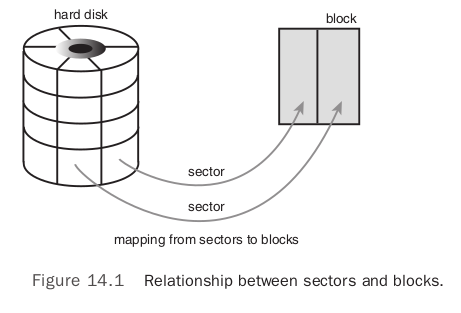
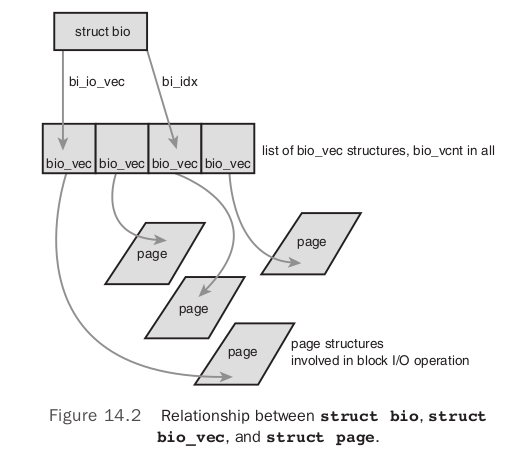

# Chapter 14: The Block I/O Layer
`Block devices` are hardware devices distinguished by the random access of fixed-size chunks of data. The fixed-size chunks of data are called `blocks`.

The other basic type of device is a `character device`. Character devices, or `char` devices, are accessed as a stream of sequential data, one byte after another.


## Anatomy of a Block Device
The smallest addressable unit on a block device is a `sector`. Sectors come in various powers of two, but 512 bytes is the most common size. The sector size is a physical property of the device, and the sector is the fundamental unit of all block devices.

`block` is the smallest logically addressable unit. The block is an abstraction of the filesystem, filesystems can be accessed only in multiples of a block.



## Buffers and Buffer Heads
When a block is stored in memory, it is stored in a `buffer`. Each buffer is associated with exactly one block. The buffer serves as the object that represents a disk block in memory. Because the kernel requires some associated control information to accompany the data, each buffer is associated with a descriptor. This descriptor is called a `buffer head` and is of type struct `buffer_head`. The `buffer_head` structure holds all the information that the kernel needs to manipulate buffers and is defined in `<linux/buffer_head.h>`.
```c
struct buffer_head {
    unsigned long b_state;             /* buffer state flags */
    struct buffer_head *b_this_page;   /* list of page’s buffers */
    struct page *b_page;               /* associated page */
    sector_t b_blocknr;                /* starting block number */
    size_t b_size;                     /* size of mapping */
    char *b_data;                      /* pointer to data within the page */
    struct block_device *b_bdev;       /* associated block device */
    bh_end_io_t *b_end_io;             /* I/O completion */
    void *b_private;                   /* reserved for b_end_io */
    struct list_head b_assoc_buffers;  /* associated mappings */
    struct address_space *b_assoc_map; /* associated address space */
    atomic_t b_count;                  /* use count */
};
```
The `b_state` field specifies the state of this particular buffer. It can be one or more of the flags in the following table. The legal flags are stored in the `bh_state_bits` enumeration, which is defined in `<linux/buffer_head.h>`.

Status Flag | Meaning
--------------- | -----------
BH_Uptodate | Buffer contains valid data.
BH_Dirty | Buffer is dirty. (The contents of the buffer are newer than the contents of the block on disk and therefore the buffer must eventually be written back to disk.)
BH_Lock | Buffer is undergoing disk I/O and is locked to prevent concurrent access.
BH_Req | Buffer is involved in an I/O request.
BH_Mapped | Buffer is a valid buffer mapped to an on-disk block.
BH_New | Buffer is newly mapped via `get_block()` and not yet accessed.
BH_Async_Read | Buffer is undergoing asynchronous read I/O via `end_buffer_async_read()`.
BH_Async_Write | Buffer is undergoing asynchronous write I/O via `end_buffer_async_write()`.
BH_Delay | Buffer does not yet have an associated on-disk block (delayed allocation).
BH_Boundary | Buffer forms the boundary of contiguous blocks; the next block is discontinuous.
BH_Write_EIO | Buffer incurred an I/O error on write.
BH_Ordered | Ordered write.
BH_Eopnotsupp | Buffer incurred a "not supported" error.
BH_Unwritten | Space for the buffer has been allocated on disk but the actual data has not yet been written out.
BH_Quiet | Suppress errors for this buffer.

The `bh_state_bits` enumeration also contains a `BH_PrivateStart` flag. This is not a valid state flag but instead corresponds to the first usable bit of which other code can make use. All bit values equal to and greater than `BH_PrivateStart` are not used by the block I/O layer proper, so these bits are safe to use by individual drivers who want to store information in the `b_state` field.

The `b_count` field is the buffer’s usage count. The value is incremented and decremented by two inline functions defined in `<linux/buffer_head.h>`:
```c
static inline void get_bh(struct buffer_head *bh)
{
        atomic_inc(&bh->b_count);
}

static inline void put_bh(struct buffer_head *bh)
{
        smp_mb__before_atomic_dec();
        atomic_dec(&bh->b_count);
}
```
Before manipulating a buffer head, you must increment its reference count via `get_bh()` to ensure that the buffer head is not deallocated out from under you. When finished with the buffer head, decrement the reference count via `put_bh()`.

The physical block on disk to which a given buffer corresponds is the `b_blocknr`-th logical block on the block device described by `b_bdev`. The physical page in memory to which a given buffer corresponds is the page pointed to by `b_page`. More specifically, `b_data` is a pointer directly to the block (that exists somewhere in `b_page`), which is `b_size` bytes in length. Therefore, the block is located in memory starting at address `b_data` and ending at address (`b_data + b_size`).

The purpose of a buffer head is to describe this mapping between the on-disk block and the physical in-memory buffer. Acting as a descriptor of this buffer-to-block mapping is the data structure’s only role in the kernel.


## The `bio` Structure
The `bio` structure is the basic container for block I/O within the kernel is the bio structure. Defined in `<linux/bio.h>`, this structure represents block I/O operations that are in flight as a list of `segments`. A segment is a chunk of a buffer that is contiguous in memory. Thus, individual buffers need not be contiguous in memory. Vector I/O such as this is called `scatter-gather I/O`.
```c
struct bio {
    sector_t bi_sector;               /* associated sector on disk */
    struct bio *bi_next;              /* list of requests */
    struct block_device *bi_bdev;     /* associated block device */
    unsigned long bi_flags;           /* status and command flags */
    unsigned long bi_rw;              /* read or write? */
    unsigned short bi_vcnt;           /* number of bio_vecs off */
    unsigned short bi_idx;            /* current index in bi_io_vec */
    unsigned short bi_phys_segments;  /* number of segments */
    unsigned int bi_size;             /* I/O count */
    unsigned int bi_seg_front_size;   /* size of first segment */
    unsigned int bi_seg_back_size;    /* size of last segment */
    unsigned int bi_max_vecs;         /* maximum bio_vecs possible */
    unsigned int bi_comp_cpu;         /* completion CPU */
    atomic_t bi_cnt;                  /* usage counter */
    struct bio_vec *bi_io_vec;        /* bio_vec list */
    bio_end_io_t *bi_end_io;          /* I/O completion method */
    void *bi_private;                 /* owner-private method */
    bio_destructor_t *bi_destructor;  /* destructor method */
    struct bio_vec bi_inline_vecs[0]; /* inline bio vectors */
};
```
The primary purpose of a `bio` structure is to represent an in-flight block I/O operation. To this end, the majority of the fields in the structure are housekeeping related. The most important fields are `bi_io_vec`, `bi_vcnt`, and `bi_idx`.



### I/O vectors
The `bi_io_vec` field points to an array of `bio_vec` structures, each of which is used as a list of individual segments in this specific block I/O operation. The entire array of these vectors describes the entire buffer.

Each bio_vec is treated as a vector of the form <page, offset, len>, which describes a specific segment: the physical page on which it lies, the location of the block as an offset into the page, the length of the block starting from the given offset.

The `bio_vec` structure is defined in `<linux/bio.h>`:
```c
struct bio_vec {
    /* pointer to the physical page on which this buffer resides */
    struct page *bv_page;

    /* the length in bytes of this buffer */
    unsigned int bv_len;

    /* the byte offset within the page where the buffer resides */
    unsigned int bv_offset;
};
```
In each given block I/O operation, there are `bi_vcnt` vectors in the `bio_vec` array starting with `bi_io_vec`. As the block I/O operation is carried out, the `bi_idx` field is used to point to the current index into the array.

Each block I/O request is represented by a `bio` structure. Each request is composed of one or more blocks, which are stored in an array of `bio_vec` structures. These structures act as vectors and describe each segment’s location in a physical page in memory. The first segment in the I/O operation is pointed to by `b_io_vec`. Each additional segment follows after the first, for a total of `bi_vcnt` segments in the list. As the block I/O layer submits segments in the request, the `bi_idx` field is updated to point to the current segment.

The `bi_idx` field is used to point to the current `bio_vec` in the list, which helps the block I/O layer keep track of partially completed block I/O operations. More importantly, it allows the splitting of `bio` structures.

The `bio` structure maintains a usage count in the `bi_cnt` field. When this field reaches zero, the structure is destroyed and the backing memory is freed.
```c
void bio_get(struct bio *bio)
void bio_put(struct bio *bio)
```

The `bi_private` field is a private field for the owner of the structure. As a rule, you can read or write this field only if you allocated the `bio` structure.


## Request Queues
Block devices maintain `request queues` to store their pending block I/O requests. The request queue is represented by the `request_queue` structure and is defined in `<linux/blkdev.h>`. The request queue contains a doubly linked list of requests and associated control information. Requests are added to the queue by higher-level code in the kernel, such as filesystems. As long as the request queue is nonempty, the block device driver associated with the queue grabs the request from the head of the queue and submits it to its associated block device. Each item in the queue’s request list is a single request, of type `struct request` (also defined in `<linux/blkdev.h>`).

Each request can be composed of more than one `bio` structure because individual requests can operate on multiple consecutive disk blocks. Note that although the blocks on the disk must be adjacent, the blocks in memory need not be; each `bio` structure can describe multiple segments and the request can be composed of multiple `bio` structures.


## I/O Schedulers
